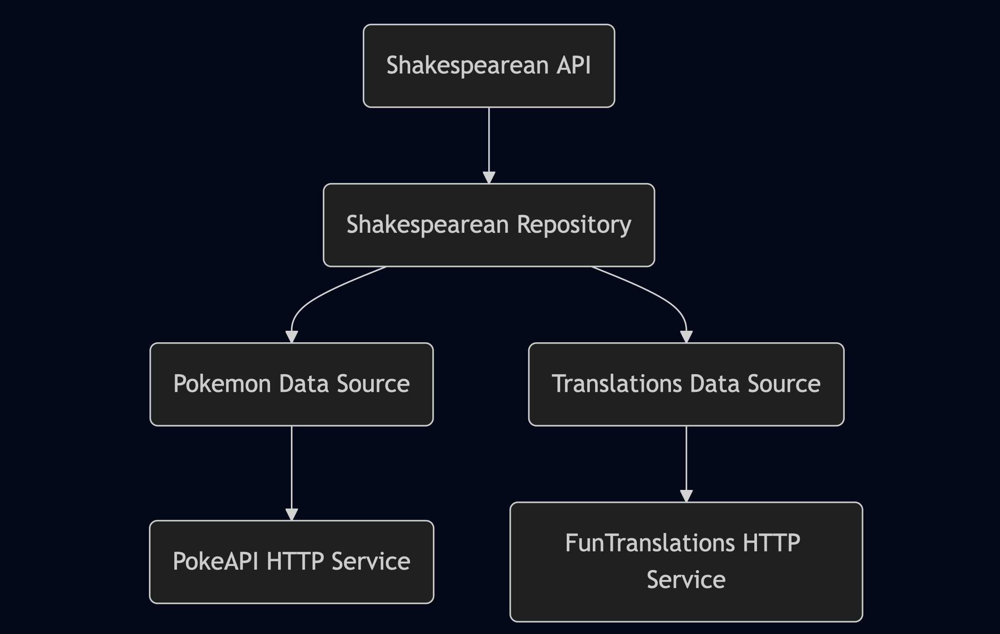

# About
The aim of the project is to show a readable, scalable and testable way to implement an SDK in iOS. It makes use of [PokeAPI](https://pokeapi.co/docs/v2) and [FunTranslations](https://funtranslations.com/api/shakespeare) for pulling relevant data to show Pokémon informations and translate them in a shakespearean manner.

## Installation

The minimum supported platform version is iOS 15.

### For Xcode projects:

You can add [shakespearemon-sdk](https://github.com/scarayaa/shakespearemon-sdk) to your project as a package.

### For Swift Package Manager:

In Package.swift add:

```swift
dependencies: [
    .package(url: "https://github.com/scarayaa/shakespearemon-sdk", from: "1.0.0"),
]
```
and in your target dependencies:
```swift
.product(name: "shakespearemon-sdk", package: "shakespearemon-sdk"),
```

## Usage

Get a new instance of the service through the exposed factory method and use the exposed methods to retrieve Pokémons' data.

```swift
import ShakespearemonSDK

let service = ShakespearemonSDK.getNewServiceInstance()

let name = "Charizard"
let description = try await service.getShakespeareanDescription(ofPokemon: name)
let spriteURL = try await service.getPokemonSpriteURL(ofPokemon: name)
```

Use the exposed built-in SwiftUI component to show the fetched data (or for whatever you like!).

```swift
PokemonDetailView(imageURL: spriteURL, description: description)
```

## Dependencies

- [RealHTTP](https://github.com/immobiliare/RealHTTP): exposes an HTTP client easy to use for making HTTP requests and stubs for mocking purposes.
- [Nuke](https://github.com/kean/Nuke): specifically `NukeUI` for quick images loading and caching, directly integrated with SwiftUI.

## Architecture

The SDK is linear and concise as follows:



- **API**: the exposed interface to interact with the SDK
- **Repository**: fetches and transforms data before sending them to the API
- **Data Source**: the interface access to the model layer. The SDK currently uses only data sources on HTTP wrappers, but any other way of retrieving data can be defined here (e.g.: a database storage data source, or a network through GraphQL)
- **HTTP Service**: the HTTP wrapper to make HTTP network calls

All the dependencies are exposed to the other layers through protocols to allow ease of testability and implementation swaps if needed.
